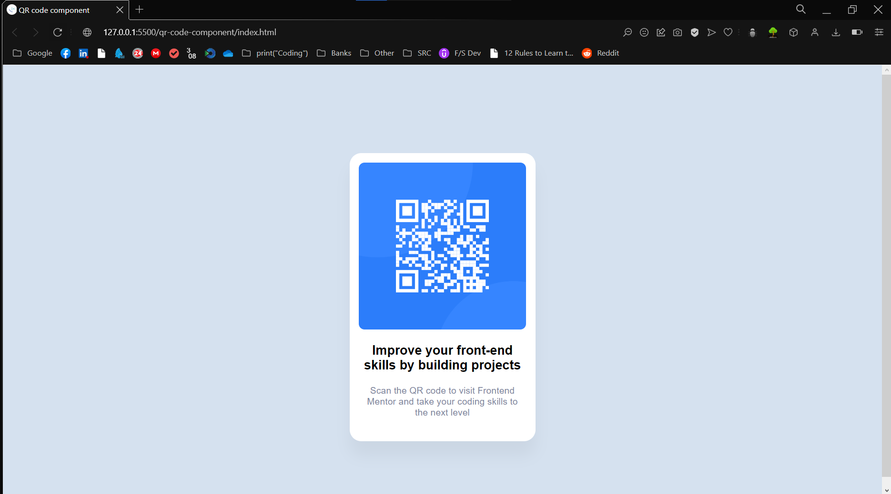

# Frontend Mentor - QR code component solution

This is a solution to the [QR code component challenge on Frontend Mentor](https://www.frontendmentor.io/challenges/qr-code-component-iux_sIO_H). Frontend Mentor challenges help you improve your coding skills by building realistic projects.

## Table of contents

- [Overview](#overview)
  - [Screenshot](#screenshot)
  - [Links](#links)
- [My process](#my-process)
  - [Built with](#built-with)
- [Author](#author)
- [Acknowledgments](#acknowledgments)

**Note: Delete this note and update the table of contents based on what sections you keep.**

### Screenshot

### Links

- Solution URL: (https://github.com/archiltavdgiridze/qr-code-component)
- Live Site URL: (https://archiltavdgiridze.github.io/qr-code-component/)

## My process

It was an easy process and everything took maybe ~30 minutes. It was first challenge, and I'm going to do other ones too!

### Built with

- Semantic HTML5 markup
- CSS custom properties

## Author

- LinkedIn - [Archil Tavdgiridze ](https://https://www.linkedin.com/in/archiltavdgiridze/)
- GitHub - [@archiltavdgiridze](https://github.com/archiltavdgiridze)

## Acknowledgments

It is my first project from frontend mentor. I want to thank my "coding pals" who helped me when I was stuck!
